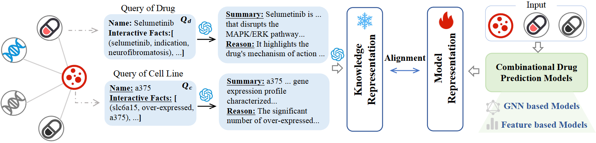

# LaCo

L2aCo is the official code repository for the paper **"Expanding Knowledge Boundaries via LLM-Grounded Alignment for Drug Combination Recommendation"**, accepted at **KDD 2026 AI4Science track**.

The project explores how to use large language model (LLM) grounded embeddings to enhance drug and cell line representations, improving drug combination prediction for long-tail and cold-start cell lines.



## Key Contributions

- Introduces **L2aCo**, a model-agnostic knowledge alignment framework.
- Uses LLM-inferred semantic profiles to augment drug and cell line representations with knowledge beyond experimental measurements.
- Aligns semantic representations with conventional molecular and cellular features at the representation level.
- Demonstrates improved generalization on long-tail and novel cell lines.

## Repository Structure

- `graph_based/` — graph-based drug combination prediction implementation with GNN models and optional LLM embeddings.
- `feature_based/` — feature-based methods, currently organized into three folders:
  - `DeepDDS/`
  - `DFFNDDS/`
  - `SynergyX/`
  These methods are placeholders for future code, data, and READMEs.
- `Combinational_Drug_Recommendation.pdf` — the full paper PDF.

## Graph-Based Module

The `graph_based/` module is the most complete implementation in this repository and includes:

- `dcb_main.py` — main training and evaluation entry point.
- `dataloader.py` — data loading and batching logic.
- `model.py` — GNN model definitions such as `GCN`, `HeteroGAT`, and `KGNN`.
- `layers.py` — regularization and layer utilities.
- `loss_util.py` — loss functions and evaluation metrics.
- `utils.py` — model saving, logging, and evaluation helpers.
- `generate_embed_bge.py` — helper script for generating BGE / LLM embeddings.
- `datasets/` — dataset input files and processed dataset artifacts.
- `ckpts/` — checkpoints output root.
- `logs/` — runtime logs.
- `wandb/` — optional W&B output.

See `graph_based/README.md` for more details.

## Feature-Based Module

The `feature_based/` module currently contains three feature-based method folders:

- `DeepDDS`
- `DFFNDDS`
- `SynergyX`

These folders are intended to support comparison and validation of LLM-augmented feature-based drug combination prediction. Code, data, and per-method documentation will be added later.

## Environment and Dependencies

Recommended Python version: `3.8+`.

Install dependencies for the graph-based module:

```bash
pip install -r graph_based/requirements.txt
```

The current `graph_based/requirements.txt` includes:

- `torch==2.5.1+cu121`
- `dgl==2.4.0+cu121`
- `numpy==1.26.3`
- `scikit-learn==1.7.2`
- `tqdm==4.67.3`
- `wandb==0.23.0`

Choose a compatible `torch` and `dgl` installation for your CUDA environment.

## Data Preparation

The graph-based experiments currently require the following dataset files:

- `datasets/kg/entities.dict`
- `datasets/kg/relations.dict`
- `datasets/kg/train_new.tsv`

The dataset is available on Hugging Face:

- https://huggingface.co/datasets/Matthewmtf/LaCo

Download the dataset and place it under the repository root so the directory structure remains consistent.

## Quick Start

Run a training example in `graph_based/`:

```bash
cd graph_based
python dcb_main.py --gpu 0 --model SAGE --dataset drugcombdb --debug --aug --llm gpt-4o-mini --setting S1
```

Common models:

- `GCN`
- `HGAT`
- `KGNN`
- `SAGE`

Common LLM options:

- `gpt-4o-mini`
- `gpt-3.5-turbo`
- `gpt-5`
- `llama3-8b-chat`
- `Baichuan2-chat`
- `llama`
- `qwen`

## Design Philosophy

L$^2$aCo is designed to:

1. Build base representations for drugs and cell lines from experimental features.
2. Expand representation boundaries with LLM-derived semantic profiles.
3. Fuse experimental and semantic knowledge through representation-level alignment to improve performance on long-tail and rare cell lines.

This plugin-style approach enables L2aCo to enhance existing drug combination predictors without redesigning their core architectures.

## Citation

If you use this repository or the associated ideas, please cite:

```bibtex
@inproceedings{ma2026expanding,
  title={{Expanding Knowledge Boundaries via LLM-Grounded Alignment for Drug Combination Recommendation}},
  author={Ma, Tengfei and He, Yuqin and Ren, Zhonghao and Song, Bosheng and Li, Qian and Zeng, Xiangxiang},
  booktitle={Proceedings of the 2026 ACM SIGKDD Conference on Knowledge Discovery and Data Mining (KDD)},
  year={2026},
  series={AI4Science Track},
  location={Jeju Island, Republic of Korea}
}
```
